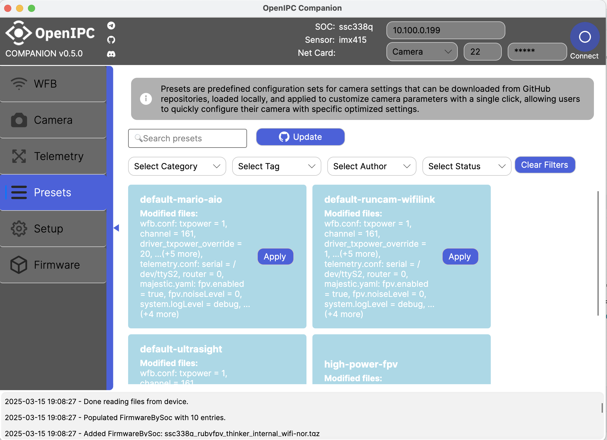
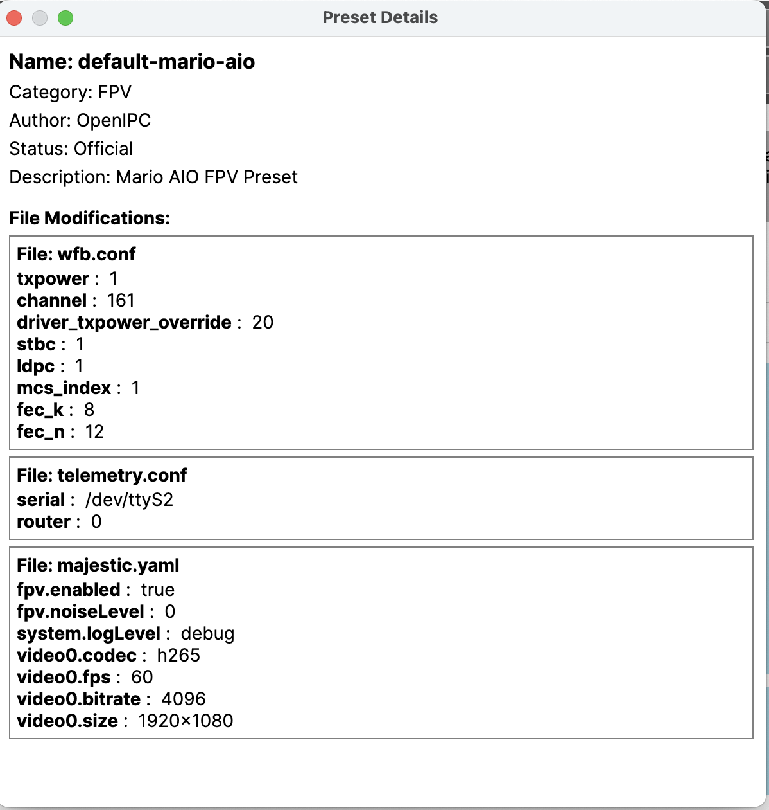

# OpenIPC FPV Presets

Collection of preconfigured presets for OpenIPC FPV Configurator application.

## Overview

OpenIPC FPV Presets provide ready-to-use configurations for FPV camera systems. These presets help you quickly set up your camera with optimal settings for different scenarios, such as racing, freestyle, or long-range flying.

### Key Benefits

- **Quickly apply optimized camera settings** for different flying styles
- **Easily share configurations** with the community
- **Standardized format** for consistent configuration across devices

## How to Use Presets

1. **Open the OpenIPC FPV Configurator** application
2. **Navigate to the Presets tab**
3. **Browse and select** a preset from the list
4. **View the details** to understand what the preset optimizes
5. **Click "Apply Preset"** to configure your camera





## How Presets Work

### Preset Layout

#### 1. Repository Structure

The repository contains:

- **`PRESET_INDEX.yaml`**: Auto-generated index of all presets with their metadata. This file is used by the OpenIPC Configurator to quickly discover and load available presets.
- **`presets/` directory**: Contains individual preset folders

Each preset is a self-contained folder under the `presets/` directory that includes:

- **`preset-config.yaml`**: Defines preset metadata, attributes, and modified files
- **Additional files** referenced in the configuration (e.g., `vtxmenu.ini`)

**Example Structure**:
```
/
├── PRESET_INDEX.yaml
├── presets/
│   ├── high_power_fpv/
│   │   ├── preset-config.yaml
│   │   ├── vtxmenu.ini
```

#### 2. Preset Definition (`preset-config.yaml`)

The `preset-config.yaml` file defines:

- **Metadata**: `name`, `author`, `description`, and `category`
- **Files**: Specifies files and their key-value modifications
- **Additional Files**: Specifies supplementary files to be copied to the device

**Example**:
```yaml
name: "High Power FPV"
author: "OpenIPC"
description: "Optimized settings for high-power FPV."
files:
  wfb.yaml:
    wireless.txpower: "30"
    wireless.channel: "161"
  majestic.yaml:
    fpv.enabled: "true"
    system.logLevel: "info"
additional_files:
  - vtxmenu.ini
```

#### 3. Application Process

When a preset is applied:

1. **File Modifications**:
    - Settings are applied to configuration files on your device
    
2. **Additional Files Transfer**:
    - Any specified additional files are copied to your device
    
3. **Logs**:
    - Success or failure of the operations is logged

## Contributing Presets

Want to share your optimal camera settings with the community? Follow these steps to contribute a preset.

### 1. Fork the Repository

1. Click the "Fork" button at the top right of this repository
2. Clone your forked repository to your local machine:
   ```bash
   git clone https://github.com/YOUR-USERNAME/fpv-presets.git
   cd fpv-presets
   ```

### 2. Create a New Preset

#### Option A: Use the Helper Script

1. Run the provided creation script which will guide you through the process:
   ```bash
   ./create_preset.sh
   ```
   This interactive script will:
   - Ask for your preset details
   - Create the necessary folder structure
   - Generate a template `preset-config.yaml` file

#### Option B: Manual Creation

1. Create a new folder inside the `presets` directory. Use a descriptive name for your preset:
   ```bash
   mkdir -p presets/my-awesome-preset
   ```

2. Inside your preset folder, create a `preset-config.yaml` file with the following structure:
   ```yaml
   name: "My Awesome Preset"
   category: "Race" # Options: Race, Freestyle, Cinematic, Indoor, LongRange, etc.
   author: "Your Name"
   description: "A detailed description of what this preset is optimized for"
   status: "Official" # Options: Draft, Testing, Stable, Official (used by OpenIPC devs)
   tags:
     - mario
     - aio
     - daylight
     - lowlatency
   
   # Camera configuration settings
   files:
     majestic.yaml:
       nightMode: false
       bitrate: 4
       wdr: false
       # Add all your camera configuration parameters here

   # Additional files to be copied to /etc on the device
   # These files must exist in your preset folder
   additional_files:
     - vtxmenu.ini
   ```

3. Add any additional files referenced in the `additional_files` section to your preset folder.

### 3. Test Your Preset

1. Test your preset with the OpenIPC FPV Configurator to ensure it works as expected
2. Verify that your `preset-config.yaml` file is properly formatted and contains all necessary settings

#### Testing with Your Forked Repository

To test presets from your forked repository before submitting a pull request, you can configure the OpenIPC Configurator to use your fork:

1. Locate the `appsettings.yaml` file on your system:
   - Mac: `$HOME/Library/Application Support/OpenIPC_Config/Logs`
   - Windows: `%APPDATA%\Local\OpenIPC_Config\Logs`
   - Linux: `~/.config/openipc-configurator.log`

2. Add your forked repository to the `Presets` section in the `appsettings.yaml` file:
   ```yaml
   "Presets": {
     "Repositories": [
       {
         "Url": "https://github.com/OpenIPC/fpv-presets",
         "Branch": "master",
         "Description": "Official OpenIPC presets repository",
         "IsActive": true
       },
       {
         "Url": "https://github.com/YOUR-USERNAME/fpv-presets",
         "Branch": "main",
         "Description": "My custom presets repository",
         "IsActive": true
       }
     ]
   }
   ```

3. Save the file and restart the OpenIPC Configurator
4. Your custom presets should now appear in the presets list within the application

### 4. Submit a Pull Request

1. Update the PRESET_INDEX.yaml file:
   - In the official OpenIPC repository, this is automatically done by GitHub Actions
   - For your forked repository, you may need to manually run the build script:
     ```bash
     ./build.sh
     ```
   - Make sure to commit the updated PRESET_INDEX.yaml file with your changes

2. Commit your changes:
   ```bash
   git add presets/my-awesome-preset/
   git add PRESET_INDEX.yaml
   git commit -m "Add My Awesome Preset for XYZ camera"
   git push origin main
   ```

3. Go to the original repository and click "Pull Request"
4. Fill out the PR template with details about your preset

### Notes

- The `PRESET_INDEX.yaml` file is automatically generated - don't modify it manually
- Each preset must include a complete `preset-config.yaml` file
- Make sure your preset has a unique and descriptive name
- Include as much detail as possible in the description to help users understand when to use your preset

## Technical Details

### Preset Loading

- The application first reads the `PRESET_INDEX.yaml` file to get a list of all available presets.
- For each preset in the index, it then loads the corresponding preset folder.
- It parses each `preset-config.yaml` to create a `Preset` object with all its settings.

### UI Workflow

- **Preset List**:
    - Displays all available presets using a `ListBox`.
    - Users can select a preset by its name.

- **Details Panel**:
    - Displays metadata (`Name`, `Author`, `Description`).
    - Lists file modifications and sensor file.

- **"Apply Preset" Button**:
    - Applies the selected preset's changes to the remote device.
    - Button is enabled only if a preset is selected.

### Key Features

- **Dynamic Preset Management**:
    - Add/remove presets by simply editing the `presets/` directory.
- **File Abstraction**:
    - Presets only define attributes; the app handles file locations.
- **User-Friendly UI**:
    - Select a preset, view details, and apply it with a single click.

### Preset Indexer

The preset indexer is a critical component that generates the `PRESET_INDEX.yaml` file used by the OpenIPC Configurator to discover and load available presets.

#### Purpose

- Generates the `PRESET_INDEX.yaml` file in the root of the repository
- Scans all presets and creates a centralized index
- Enables the OpenIPC Configurator to quickly load available presets without scanning individual directories

#### Implementation

- Located at `tools/indexer/indexer.js` in the repository
- Run using: `npx node tools/indexer/indexer.js`
- Automatically called by the `build.sh` script during repository updates

#### How It Works

1. The indexer scans through all folders in the `presets/` directory
2. It reads each `preset-config.yaml` file it finds
3. It extracts metadata (name, author, category, tags, etc.)
4. It compiles all this information into a single `PRESET_INDEX.yaml` file in the root of the repository

#### Running the Indexer Manually

When developing locally, you need to run the indexer after making changes:

```bash
# From the repository root
npx node tools/indexer/indexer.js
```

Or simply use the build script:

```bash
# From the repository root
./build.sh
```

#### Important Notes

- The indexer must be run after any changes to preset files
- Never edit `PRESET_INDEX.yaml` manually as it will be overwritten by the indexer
- The index file is crucial for the OpenIPC Configurator to discover presets
- In the official repository, GitHub Actions automatically runs the indexer when changes are pushed
- When working with a forked repository, you must manually run the indexer before submitting a pull request

## Future Enhancements

* Add capability for users to add their own repositories
* Save current settings to a file
* Import/export preset configurations between devices